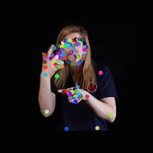

# CorrNet Pose Distillation
This Repo is bsed on CorrNet 2023 (CVPR 2023) [[paper]](https://arxiv.org/abs/2303.03202)


## Prerequisites

- This project is implemented in Pytorch (better >=1.13 to be compatible with ctcdecode or these may exist errors). Thus please install Pytorch first.

- ctcdecode==0.4 [[parlance/ctcdecode]](https://github.com/parlance/ctcdecode)，for beam search decode. (ctcdecode is only supported on the Linux platform.)

   You may use the python version evaluation tool for convenience (by setting 'evaluate_tool' as 'python' in line 16 of ./configs/baseline.yaml), but sclite can provide more detailed statistics.

- You can install other required modules by conducting 
   `pip install -r requirements.txt`

## Implementation
The implementation for the CorrNet (line 18) is given in [./modules/resnet.py](https://github.com/hulianyuyy/CorrNet_CSLR/blob/main/modules/resnet.py).  

It's then equipped with the BasicBlock in ResNet in line 58 [./modules/resnet.py](https://github.com/hulianyuyy/CorrNet_CSLR/blob/main/modules/resnet.py).

We later found that the Identification Module with only spatial decomposition could perform on par with what we report in the paper (spatial-temporal decomposition) and is slighter faster, and thus implement it as such.

## Data Preparation

### OpenASL dataset
1. Download the OpenASL dataset from (https://github.com/chevalierNoir/OpenASL)
2. Download the GloFE repo from (https://github.com/HenryLittle/GloFE)
3. Install MMPose==0.29.0 from (https://github.com/open-mmlab/mmpose/tree/v0.29.0)
4. Follow the instructions of the GloFE github to extract the pose information from OpenASL using MMPose. 
```
### Extracting pose data for OpenASL using MMPose
Set output path in `GloFE/tools/extract_openasl_mp.py`:
```python
    # config output_root in tools/extract_openasl_mp.py
    arg_dict = {
        ...
        'output_root': '/path/to/OpenASL/mmpose',
        ...
    }
```

```
Generate `open_asl_samples.txt` and set it in `tools/extract_openasl_mp.py`. Each line in `open_asl_samples.txt` is the full path to the `mp4` file.
all_samples = load_sample_names('/path/to/open_asl_samples.txt')
```
Install MMPose and set the `MMPOSE_ROOT`(path to MMPose's git dir) in `tools/extract.sh`. After installation, download the model checkpoints listed in `tools/extract.sh` and put them in `/path/to/mmpose/models`. Then run `tools/extract.sh`
```bash
    sh tools/extract.sh 0 1 0
                        │ │ └─ # GPU device-id to run on
                        │ └─── # Number of sub-splits (for parallel extraction)
                        └───── # Split id for this process
```
If you encountered version mismatch, try the following ones (thanks to @sandeep-sm in [issue #4](https://github.com/HenryLittle/GloFE/issues/4)):
```bash
MMPose - v0.29.0
mmcv==1.6.2
mmdet==2.25.2
mmtrack>=0.6.0
xtcocotools==1.12
```

The generated files will serve as soft targets on teaching the student model 

Use `python create_video_list.py` to generate `valid_test_vids.txt`


## Inference

In the inference, we use a trained/pre-trained student model based on the ResNet18 architecture to extract pose information from the OpenASL videos

Inside of CorrNet/extract.sh, edit the line 'python extract_openasl_cv_sequence_v3.py \' to run the appropriate python pose extraction file file depending on the configuration

Within the line 
`model = load_model_weights(model, 'model_weights')'`
Specify the filepath to the model weights for the configuration being used

Set `'output_root': 'keypoints_regression_seq_v3_timing'` to the desire output folder to contain the output pkl files.

Within the line 
`all_samples = load_sample_names('../valid_test_vids.txt')`, Direct the file to valid_test_vids.txt. 

### Evaluation
To evaluate the performance of the student model in pose estimation performance, we leverage GloFE Sign Language Translation as a downstream evaluator. The final BLEU translation score will serve as the metric for measuring the performance of the student model. A better performing student model would have higher BLEU scores

1. Follow the steps specified inference to use a trained student model to generate pose data from OpenASL videos

2. Within `work_dir/openasl/vm_model/exp_config.json`, direct "feat_path" to the pose data generated by the student model.

3. Run GloFE in inference mode with `sh scripts/openasl/test.sh`. If you have not previously set up a GloFE venv or conda environment, then use `pip install -r GloFE/requirements2.txt`

## Training

The priorities of configuration files are: command line > config file > default values of argparse. To train the student model, run the command below:

`python main.py --config ./config/baseline.yaml --device your_device`

For example
`python ./main.py --config ./configs/keypoint_regression_img_v18_max16_bs8.yaml --device 0`

## Model Configurations
The following table describes the training configurations defined in the `./config` directory. 
Each configuration corresponds to a different model architecture or feature extraction strategy used during experimentation.


| Config File | Model Type | Backbone | Feature Extraction | Notes |
|-------------|------------|----------|--------------------|------|
| keypoint_regression_img_v13 | Non-sequential | ResNet-18 | Features extracted from the middle of the ResNet before further downsampling, producing a 7×7×256 feature map | Baseline image model |
| keypoint_regression_img_v14 | Non-sequential | ResNet-34 | Features extracted from the middle of the ResNet before further downsampling, producing a 7×7×256 feature map | Higher-capacity backbone |
| keypoint_regression_img_v15 | Non-sequential | ResNet-34 | Features extracted after the final downsampling layer, resulting in a 7×7 feature representation | Resolution too low; training stopped after 1 epoch |
| keypoint_regression_img_v16 | Non-sequential | ResNet-34 | Features extracted after the final downsampling layer, resulting in a 7×7 feature representation | Resolution too low; training stopped after 1 epoch |
| keypoint_regression_seq_v3 | Sequential | ResNet-18 | Per-frame features extracted from the middle of the ResNet before downsampling, producing 7×7×256 feature maps | Correlation calculated between consecutive frames |
| keypoint_regression_seq_v3_tconv | Sequential | ResNet-18 | Same feature extraction as v3 | Output sequence passed through a Temporal Convolution layer; poor performance, training stopped after 1 epoch |
| keypoint_regression_seq_v3_tconv-BiLSTM | Sequential | ResNet-18 | Same feature extraction as v3 | Temporal Convolution followed by a BiLSTM layer; poor performance, training stopped after 1 epoch |
| keypoint_regression_seq_v4 | Sequential | ResNet-34 | Per-frame features extracted from the middle of the ResNet before downsampling, producing 7×7×256 feature maps | Correlation calculated between consecutive frames |

## Experimental Results

To evaluate the quality of the estimated keypoints, we use **BLEU scores as a downstream evaluation metric**. The pose sequences predicted by the student model are used as input to the **GloFE Sign Language Translation** pipeline, and the resulting translation BLEU scores are reported.

This evaluation measures how well the predicted pose sequences preserve the linguistic information necessary for sign language translation. **Higher BLEU scores indicate better keypoint estimation quality.**

| Pose Source | BLEU-1 | BLEU-2 | BLEU-3 | BLEU-4 |
|-------------|--------:|--------:|--------:|--------:|
| **Teacher (MMPose HRNet)** | **20.65** | **8.38** | **4.63** | **2.72** |
| **Student Model (Non-Sequential)** (`keypoint_regression_img_v13`, ResNet-18) | 19.05 | 7.93 | 4.40 | 2.57 |
| **Student Model (Sequential)** (`keypoint_regression_seq_v3`, ResNet-18) | 16.81 | 6.93 | 3.74 | 2.13 |

### Summary

- The **teacher model (MMPose HRNet)** provides the highest BLEU scores and serves as the upper-bound reference.
- The **non-sequential student model** (`keypoint_regression_img_v13`) achieves performance close to the teacher while using a lightweight **ResNet-18** backbone.
- The **sequential student model** (`keypoint_regression_seq_v3`) performs worse than the non-sequential variant, suggesting that the current temporal correlation formulation does not yet provide a benefit for pose distillation on OpenASL.

> **Note:** BLEU is used as an indirect measure of pose estimation accuracy. Better predicted keypoints should enable better downstream sign language translation performance.

## Visualizations
For Grad-CAM visualization, you can replace the resnet.py under "./modules" with the resnet.py under "./weight_map_generation", and then run ```python generate_cam.py``` with your own hyperparameters.


### Overlay generated keypoints onto sign language video
After using a trained student model in inference mode to extract pose data, we may visualize these generated keypoints by overlaying them onto a sign language video.

1. Follow Inference to extract pose keypoints using a trained student model
2. Within `visualize_keypoints.py`, set `pose_path` to the filepath of the extracted .pkl pose data
3. Within `visualize_keypoints.py`, set `video_path` to the filepath of the video file which matches the pose data
4. Set `out_file_name` to the desired filename for the output video with the overlaid keypoints
5. Run `visualize_keypoints.py`

<div align="center">

<h4>Overlaid Keypoints</h4>
</div>

### Test with one video input
Except performing inference on datasets, we provide a `test_one_video.py` to perform inference with only one video input. An example command is 

`python test_one_video.py --model_path /path_to_pretrained_weights --video_path /path_to_your_video --device your_device`

The `video_path` can be the path to a video file or a dir contains extracted images from a video.

If you find this repo useful in your research works, please consider citing:

```latex
@inproceedings{hu2023continuous,
  title={Continuous Sign Language Recognition with Correlation Network},
  author={Hu, Lianyu and Gao, Liqing and Liu, Zekang and Feng, Wei},
  booktitle={Proceedings of the IEEE/CVF International Conference on Computer Vision},
  year={2023},
}
```
